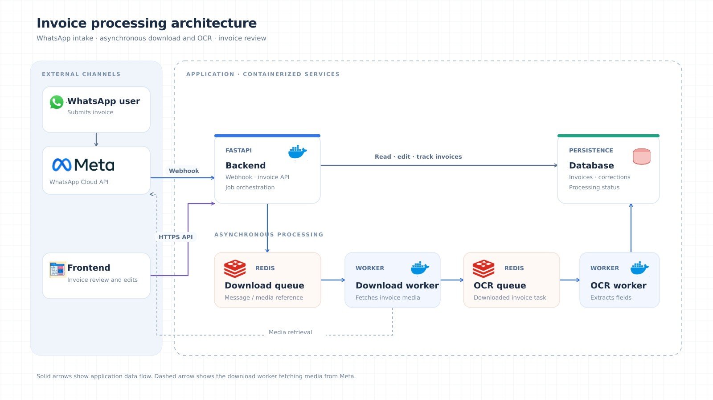

# Architecture

[Start here](../README.md) · [Processing](invoice-processing.md) · [Data model](data-model.md) · [Development](development.md)

The [SVG source](architecture-diagram.svg) shows the intended architecture.
The current application has three Python processes: FastAPI, a download worker,
and an OCR worker. Docker Compose runs Redis only. The default SQL database is
SQLite; there is no frontend, invoice review/edit API, or corrections table yet.

## Components and code

| Diagram component | Code | Responsibility |
| --- | --- | --- |
| Backend / Meta webhook | [main.py](../main.py), [events.py](../src/whatsapp/events.py) | Verify Meta's subscription challenge; translate supported attachments into download jobs. |
| Download and OCR queues | [redis_streams.py](../src/jobs/redis_streams.py), [contracts.py](../src/jobs/contracts.py) | Serialize jobs, deliver through consumer groups, reclaim idle jobs, retry, and dead-letter failures. |
| Download worker | [download.py](../src/workers/download.py), [media.py](../src/whatsapp/media.py) | Resolve the sender, create the submission, retrieve media from Meta, and enqueue OCR. |
| OCR worker | [ocr.py](../src/workers/ocr.py), [src/ocr](../src/ocr), [accounting.py](../src/invoices/accounting.py) | Prepare the document, extract an `Invoice`, reconcile fiscal values, and persist it. |
| Database | [models.py](../src/persistence/models.py), [operations.py](../src/persistence/operations.py), [database.py](../src/persistence/database.py) | Store customers, submissions, and invoices; own durable processing transitions. |

## One attachment through the system

1. `POST /webhook` extracts attachment events and publishes `DownloadJob` messages
   to `whatsapp:downloads`. It returns 200 after all extracted jobs are published;
   this confirms enqueueing, not OCR completion. Ignored events also return 200.
2. `DownloadWorker.process_download()` creates or reuses the customer, phone
   mapping, and submission. It downloads the file outside the SQL transaction,
   then commits its relative path, size, and download status.
3. The consumer atomically publishes an `OcrJob` to `whatsapp:ocr` and acknowledges
   and deletes the download entry. The OCR job carries the submission ID, not
   the file contents.
4. `OcrWorker.process_ocr()` records the attempt, resolves the stored file, and
   calls `invoice_extractor.extract_invoice(path)` outside the SQL transaction.
5. `reconcile_invoice()` fills derivable missing values and checks arithmetic.
   `InvoiceSubmissionLifecycle.save_invoice()` stores the invoice and marks its
   submission completed in one transaction. The OCR queue entry is then removed.

Workers use `InvoiceSubmissionLifecycle` for short SQL transactions. Its reads
reconstruct the shared `Invoice` before closing the session. Provider-specific
responses are converted to this same model, so persistence does not depend on
which OCR backend is selected.

## Storage and delivery

| Location | Contents | Lifetime |
| --- | --- | --- |
| SQL | Customers, phone mappings, submission progress/errors, invoice and tax rows | Permanent application records. |
| `WHATSAPP_MEDIA_DIR` | Original attachments under `YYYY/MM/DD/<media-id>.<extension>` | Kept separately from SQL; workers must share access to this directory. |
| `.ocr_preprocessing` by default | Local model weights and prepared-page cache | Reusable local processing artifacts; originals remain unchanged. |
| Redis active streams | Pending download/OCR jobs | Successful and superseded retry entries are acknowledged and deleted. |
| Redis dead-letter streams | Exhausted or malformed jobs with error context | Bounded retention; see [development settings](development.md#configuration). |

Dead-letter streams are `whatsapp:downloads:dead` and `whatsapp:ocr:dead`.
Consumer groups are `invoice-downloaders` and `invoice-ocr-workers`.

Consumer groups provide redelivery of unacknowledged jobs, not exactly-once
execution. A deterministic submission UUID derived from the WhatsApp message ID,
a unique message ID in SQL, and reuse of downloaded/completed records make normal
redelivery idempotent. File writes, SQL commits, and Redis operations are separate
steps; replay can occur between them.

## Current boundaries

`GET /webhook` handles the verification challenge; `POST /webhook` handles inbound
events. Incoming POST signatures are not verified. Subscription verification does
not authenticate subsequent events; signature verification remains a deployment
requirement before exposing the webhook publicly.

The downloader validates the HTTPS host, MIME type, size limit, and supplied
SHA-256 digest. Download and OCR failures are retried independently. There is no
implemented manual review workflow or automatic replay of permanently failed
submissions.
