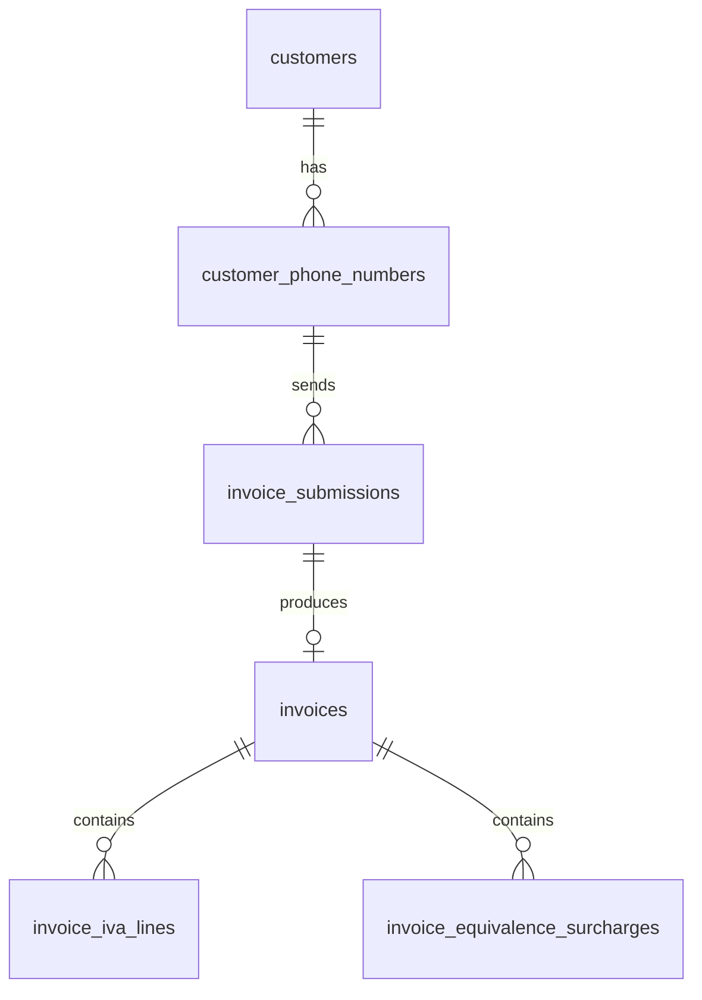

# Data model

[Start here](../README.md) · [Architecture](architecture.md) · [Processing](invoice-processing.md) · [Development](development.md)

[SQLAlchemy records](../src/persistence/models.py) define the tables;
[Alembic migrations](../migrations/versions) evolve the schema.

## Tables and important fields

| Table | Purpose and relationships | Keys | Meaningful fields |
| --- | --- | --- | --- |
| `customers` | Holds our customer's legal and contact information independently of the phone they use. One customer can have several phone numbers. This is the submitter, not the invoice supplier. | UUID `id`; unique optional `tax_id` | `display_name`, optional `legal_name`, `tax_id`, `address`, `email`; `is_provisional`; creation/update timestamps. |
| `customer_phone_numbers` | Maps each sender phone to a customer, so submissions from different registered numbers belong to the same customer. Each phone belongs to one customer and can send many submissions. | `phone_number` primary key; `customer_id` → customer | Optional `meta_user_id`, `profile_name`; `first_seen_at`, `last_seen_at`. Meta user ID is indexed but not unique. |
| `invoice_submissions` | Processing audit record for each attachment: when it arrived, downloaded, and underwent OCR, which extractor ran, and whether processing failed. Links the sender phone to at most one extracted invoice; failed processing can leave no invoice. | UUID `id`; unique `whatsapp_message_id`; `sender_phone_number` → phone | Meta `whatsapp_media_id`, `message_type`, `mime_type`, optional `sha256` and `original_filename`; downloaded `storage_path` (unique) and `file_size`; processing fields below. |
| `invoices` | Main business result: extracted invoice information and its classification/accounting decisions. One row per submission, with zero or more VAT and RE rows. Keeps invoice data separate from processing metadata. | `document_id` is both primary key and FK → submission | `validity`, `diagnostic_type`, `fiscal_status`; `fecha`, `numero_factura`, `nif_proveedor`, `nombre_proveedor`, `total`; optional `base_retencion`, `tipo_irpf`, `cuota_irpf`; `extracted_at`. |
| `invoice_iva_lines` | Stores the repeatable VAT breakdown: one invoice can contain several tax bases/rates. Separate rows preserve each breakdown without duplicating the parent invoice. | Composite key `(document_id, position)`; `document_id` → invoice | `base_imponible` (taxable base), `tipo_iva` (VAT percentage), `cuota_iva` (VAT amount). |
| `invoice_equivalence_surcharges` | Stores repeatable RE breakdowns separately from VAT because they are different fiscal concepts. One invoice can contain several surcharge rows without duplicating the parent invoice. | Composite key `(document_id, position)`; `document_id` → invoice | `base_imponible`, `tipo_re` (surcharge percentage), `cuota_re` (surcharge amount). |

To find the customer behind an invoice, follow `invoices.document_id` →
`invoice_submissions.sender_phone_number` → `customer_phone_numbers.customer_id`
→ `customers.id`. In `invoices`, `document_id` is unique; in each fiscal child
table it can repeat, with `position` distinguishing the rows.

Submission processing fields are `status`, `download_attempts`, `ocr_attempts`,
`extractor_name`, `failure_stage`, and `last_error` (up to 2,000 characters).
Timestamps record receipt, download, first OCR start, completion, creation, and
last update. A queued attachment has no SQL submission until the download worker
starts processing it.

Tax positions are zero-based and preserve row order. Deleting a submission
cascades to its invoice and tax rows; deleting a referenced customer or phone is
restricted. `alembic_version` is migration bookkeeping, not a business table.

## Stored values

### Submission status

| `status` | Meaning |
| --- | --- |
| `received` | Submission created; download has not started. Usually transient within the first transaction. |
| `downloading` | Download attempt started; file metadata has not been committed. |
| `downloaded` | File saved and its metadata committed; ready for OCR. |
| `ocr_processing` | OCR attempt started; invoice result has not been committed. |
| `completed` | Invoice result saved, including classification and fiscal status. |
| `failed` | A processing stage exhausted its attempts. |

`failure_stage` is `download` or `ocr`, and otherwise null. `message_type` is
`image` or `document`; documents must be PDFs. Attempt counters count processing
starts; queue jobs also carry their own retry `attempt` value, starting at 1.

### Invoice decisions

These are independent: **completed processing does not imply a valid invoice or
consistent accounting**.

| Field | Value | Meaning |
| --- | --- | --- |
| `validity` | `valid` | Recognized as an accepted invoice document under the classification rules. |
| `validity` | `invalid` | Provisional, non-invoice, unreadable, or rejected by those rules. Readable fields are still extracted. |
| `fiscal_status` | `reconciled` | Required fiscal values were present and accounting checks passed without changes. |
| `fiscal_status` | `corrected` | Missing values were calculated and the completed data passed the checks. |
| `fiscal_status` | `missing_data` | Insufficient usable data to complete and verify the required fiscal values. |
| `fiscal_status` | `math_error` | Required data is available but VAT or total checks fail. Existing OCR values are preserved. |

`diagnostic_type` is optional descriptive text, not an enum. Prompt-defined
examples include `Proforma`, `Resguardo de datáfono`, and `Datos fiscales
insuficientes`; other descriptions are permitted. Unreadable results can use
`ilegible` from the prompt or `Unreadable` from the empty-text fallback.
`review` is a benchmark annotation, never a stored validity value.

`is_provisional=true` means the customer was created automatically from WhatsApp
identity; it does not describe the invoice. The current pipeline creates these
provisional customers and does not implement their later enrichment.

## Field conventions

`fecha` is the invoice date, `numero_factura` its number, and
`nif_proveedor` / `nombre_proveedor` the supplier's tax ID / name. IVA is VAT;
RE is recargo de equivalencia (an additional tax surcharge); IRPF is income-tax
withholding. `base_retencion` is its base, `tipo_irpf` its rate, and `cuota_irpf`
its signed amount.

- Unknown/unreadable extracted fields are null. The domain `Invoice` uses empty
  tuples for absent IVA/RE rows and `None` for absent IRPF. SQL stores IRPF on the
  invoice row; IVA and RE are separate child rows.
- Amounts are decimal **strings**, e.g. `"1117.04"`, without currency symbols or
  thousands separators. Rates are percentage points: `"21"` means 21%, not 0.21.
  Accounting converts these to `Decimal` and rounds money to cents.
- `fecha` is a string, normally `YYYY-MM-DD` when unambiguous. Invoice numbers and
  supplier tax IDs retain printed punctuation and leading zeroes.
- `cuota_irpf` preserves its printed sign; the total check adds that signed amount.
- Phone keys use a leading `+` and 8–15 international digits. Event timestamps are
  converted to UTC. `storage_path` is relative to `WHATSAPP_MEDIA_DIR`.
- Historical invoice rows may have null `validity` or `fiscal_status`. The domain
  reader rejects them with a reprocessing error; it does not invent decisions.

Fiscal correction details and Surya source evidence are not stored in these
tables. Benchmarks can include correction details in their reports.
